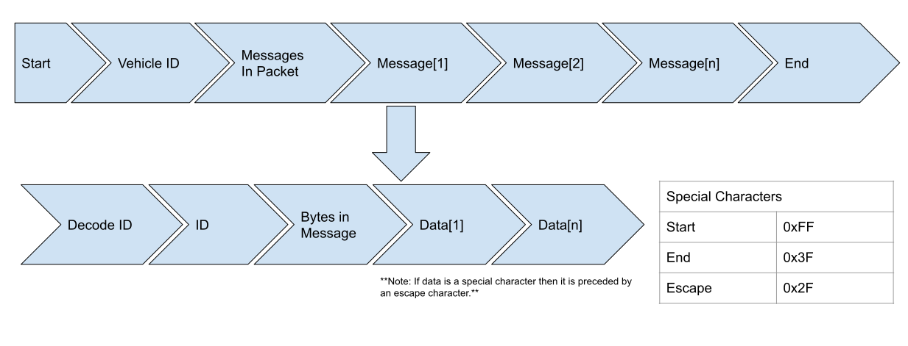

# Open Telemetry
The open telemtery application allows users to create virtual representations of telemetry items and see the data provided by those telemetry items in realtime. The project is created in three main parts the collector, user client, and the backend. The collector is responsible for interpreting the data received from telemetry items and mutating it into a format to be stored in the database and eventually be consumed by the visualizer. The backend is responsible for passing data recieved by the collector to the user clients and storing virtual telemetry items created by the user to be consumed by the collector.
## See Open Telemetry in action
TODO: Create demo
## Configuring and building Open Telemetry locally
Open telemetry is built using the MERN stack (MongoDB, Express, React, Node). Pre-requisites to this is having a mongo database set up locally or at https://www.mongodb.com/cloud/atlas, and having installed node from https://nodejs.org/en/. After you have done these you can begin setting up the project by following these steps.
1. Clone the source code from this repository.  
`git clone https://github.com/John-Carr/OpenTelemetry.git`
2. Install development dependencies.  
`npm install`
3. Setup configuration files.  
`backend/config/default.json`
```json
{
"mongoURI": "URI for mongo db server"
}
```
4. Run a local development server.  
`npm start`
## Sending Data to Open Telemetry
Setting up the device (referred to as vehicle thorught the code) to send data in a format acceptable by the collector refer to this diagram.  
  
Special characters are used in the transport layer, so the size fields **DO NOT** include space for escape characters. Specific implimentation details can be found in the collector section.  
**Status:**
Currently all data is received in a byte array over a com port, in the future this will be abstracted to be able to handle http requests, and varius sized arrays and other formats such as direct json.
## Backend
This is for all of our standard updates.
* Creating vehicles
* Creating telemetry items
* Getting historical data
Hosted on port 5000
## Client
All the pretty stuff
Hosted on port 3000
### Telem Items
**Telemetry Item**
```json
{
    "id": "Number",          
    "name": "String",        
    "description": "String", 
    "iso": "Enum",
    "values": []             
}
```
| id          | Number | id received by the collector that tells the collector how to parse the data                                                   |
|-------------|--------|-------------------------------------------------------------------------------------------------------------------------------|
| name        | String | Name of the device that produces the data                                                                                     |
| description | String | A description of the device that produces the data                                                                            |
| iso         | Enum   | This is a value that will tell the collector to use a predefined decode method useful for things like GPS                     |
| values      | Array  | A list of objects that represent the values that the device sends to the collector **in the order that the device sends it**  |
**Telemetry Item Values**
```json
{
    "name": "String",  
    "units": "String", 
    "signed": "Bool",  
    "format": "Enum",  
                    
                    
    "padded": "Bool",  
    "scalar": "Number",
    "mask": [2],       
    "isEnum": "Bool",  
    "enum": [],        
    "bytes:": "Number" 
}
```
| Field  | Type      | Description                                                                                                                          |
|--------|-----------|--------------------------------------------------------------------------------------------------------------------------------------|
| name   | String    | Name of the value such as Battery Voltage                                                                                            |
| units  | String    | Units of the item                                                                                                                    |
| signed | Bool      | If the value should be treated as two's compliment                                                                                   |
| format | Enum      | method the collector will use to parse the value [unaligned, unaligned bool, bool, 8, 16, 32, 64, IEEE Float]                        |
| padded | Bool      | Used if the value is unaligned, if the value is unaligned but zero padded this will tell the collector to realign for the next parse |
| scalar | Number    | Number to multiply the value by once it is parsed                                                                                    |
| mask   | Array [2] | Used in unaligned format, the upper an lower byte will be ANDed by these numbers respectively                                        |
| isEnum | Bool      | If the value should be enumerated                                                                                                    |
| enum   | Array     | Array of strings that can be refrenced if the data is an enum                                                                        |
| bytes  | Number    | Used in unaligned format, the number of bytes that the value spans                                                                   |
### Homepage
Routed at `/`
### Create Vehicle Page
### Active Sessions
#### Pit stop assignments
### Inventory